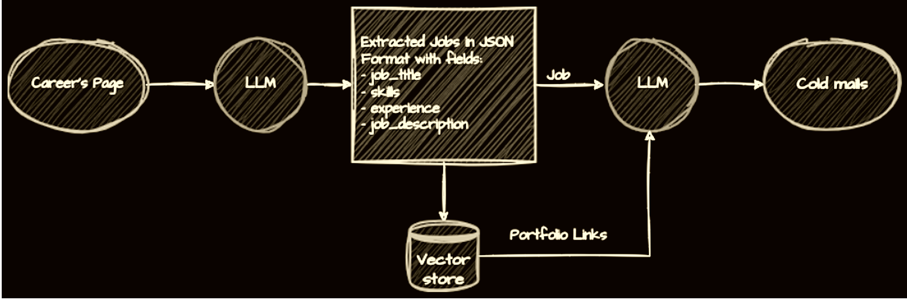
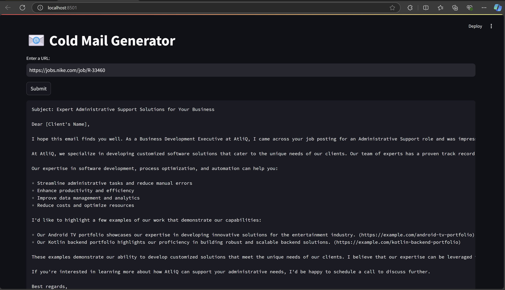

# LLM Cold Email Generator for Small Enterprises

### Overview
This project provides a **cold email generation solution** aimed at **small enterprises** targeting **large client companies** for **human resources** and project-based services. It leverages **Llama 3.1** (via **GroqCloud**) and a **ChromaDB** vector store to create **context-aware** emails based on job postings from potential clients, positioning small businesses as flexible, cost-effective partners.

I was inspired by the original project by [Codebasics](https://youtu.be/CO4E_9V6li0?si=SPp8quNskqhYiak4).

## Some Advantages
- **Automated Cold Email Generation**: Tailored emails based on client job listings.
- **Skill Matching**: Matches require skills to store portfolios in a vector database.
- **Professional Email Content**: Context-aware emails with a natural, professional tone.
- **Agile Service Pitching**: Helps small businesses pitch themselves as on-demand experts.

## Architecture Diagram


## Technologies used
- **GroqCloud**: Cloud platform hosting **Llama 3.1**.
- **ChromaDB**: Vector database for fast portfolio matching.
- **Open-Source LLM**: Llama 3.1, fine-tuned for contextual email generation.

## Installation
1. **Clone the repository:**
   ```bash
   git clone https://github.com/your-username/LLM-Cold-Email-Generator.git
   cd LLM-Cold-Email-Generator
   ```

2. **Install dependencies:**
   ```bash
   pip install -r requirement.txt
   ```

3. **Set up GroqCloud & ChromaDB:**
   - Follow the GroqCloud setup instructions [here](https://groqcloud.com/docs) to connect to your Llama 3.1 environment.
   - Set up ChromaDB by following their official documentation [here](https://chromadb.com/docs).
   
4. **Configure the Environment:**
   Update the `.env` file with necessary API keys and configurations:
   ```bash
   GROQCLOUD_API_KEY=<your-groqcloud-api-key>
   ```

5. **Run the Application using streamlit:**
   ```bash
   streamlit run main.py
   ```

## Usage

   The generated email will contain:
   - A professional introduction
   - The key skills and services offered by the small enterprise
   - A reference to the job requirements, showcasing the portfolio match
   - A call to action for further communication or collaboration

## Basic flow of control
1. **Job Portal Scraping**: Extracts job requirements from client companies' public job portals.
2. **Portfolio Matching**: Uses **ChromaDB** for portfolio-vector matching based on required skills.
3. **Cold Email Generation**: Emails are generated using the **Llama 3.1** model running on **GroqCloud**.
   
Sample Output:


## Future Enhancements
- **Multilingual Support**: Plan to implement email generation in multiple languages to target global clients.
- **Advanced Portfolio Matching**: Incorporating more sophisticated AI-based portfolio matching to better align offerings with complex job requirements.
- **Automated Job Scraping**: Adding support for automated and scheduled job scraping from various platforms.
